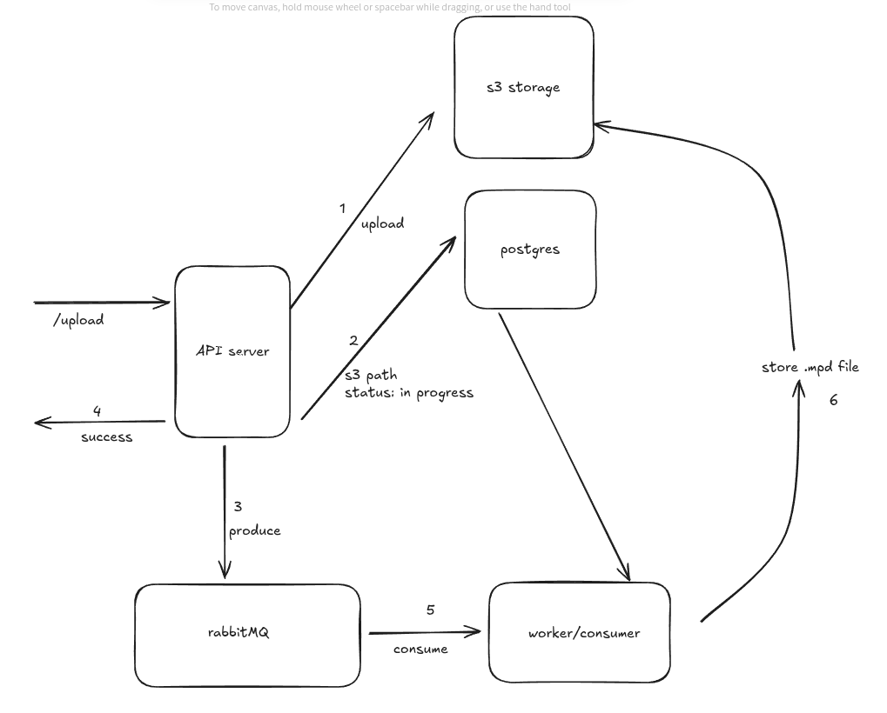

**Project: Mocker**
## Description
oursTube is a full-stack, containerized video sharing platform inspired by YouTube. It enables users to upload, transcode, search, and stream videos with support for multiple resolutions, real-time notifications, and scalable microservices. The project leverages modern technologies such as Node.js, React, Docker, PostgreSQL, MinIO (S3-compatible object storage), RabbitMQ, Elasticsearch, and Redis to deliver a robust and extensible media platform.

## Demo

Key Features
Video Upload & Transcoding: Users can upload videos, which are automatically transcoded into multiple resolutions for adaptive streaming.
DASH Streaming: Videos are streamed using MPEG-DASH for efficient, high-quality playback across devices.
Search & Discovery: Integrated Elasticsearch enables fast and relevant video search.
Scalable Microservices: Decoupled services for upload, processing, and notifications using RabbitMQ and Redis Pub/Sub.
Object Storage: Video files and thumbnails are stored and served via MinIO, supporting scalable and reliable storage.
Real-Time Updates: Server-Sent Events (SSE) and Redis enable real-time notifications for video processing and status updates.
User-Friendly Interface: A modern React frontend for browsing, searching, and uploading videos.
API Documentation: Swagger UI provides interactive API documentation for easy integration and testing.
Containerized Deployment: All services are orchestrated with Docker Compose for easy setup and scalability.

## Technologies used:
    * Backend: Node.js, Express, TypeScript, PostgreSQL, Prisma ORM, MinIO SDK, Elasticsearch, RabbitMQ, Redis
    * Frontend: React, TypeScript, Vite, Axios, Firebase
    * DevOps: Docker, Docker Compose, Swagger (OpenAPI)

### Getting Started
1. You need to create a firebase project and an app and install the app's firebaseConfig and the admin config. Then you have to create a folder named "auths" in the rootlevel of the project.
The structure of the folders inside ourstube will look as per below
oursTube/
|--auths/
|   --firebase-admin.json
|   --firebase.ts
|-- client/
|-- server/
Note: the names should be exactly the same inside auth folder
firebase-admin.json will contain admin keys
firebase.ts will contain app's keys

2. install Docker and docker compose and run the command `docker-compose -f docker-compose.yml up -d --build` which will create all containers and run them

3. access the app using `localhost:3000`

### Backend Design

### API Documentation and Usage

| Column 1 Method | Column 2 Endpoint | Description |
| --- | --- | --- |
| --- | Auth API's | --- |
| POST | /api/v1/video/upload | uploads a new video with given data |
| GET | /api/v1/video/search | search a video with given params |
| GET | /api/v1/video/all | returns list of all uploaded videos |
| GET | /api/v1/video/manifest/:filepath | returns the .mpd dash file of a video |
| GET | /api/v1/video/segment/:filepath/:filename | returns a segment of a video |
| GET | /api/v1/video/sse/:videoId | Open SSE connection for video processing status |
| GET | /api/v1/video/thumbnail/:videoId |Get video thumbnail |

If you have found any Bug in the application or have an Idea to improvise the project then connect with me on my LinkedIn profile https://www.linkedin.com/in/somu-nath-7a4a72181/